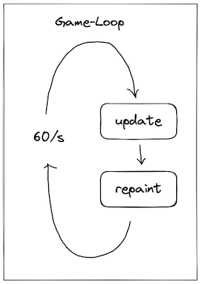
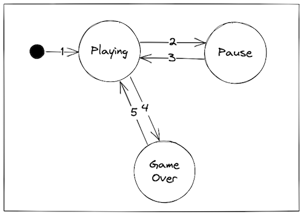

# Final de Programacion Avanzada
Juego desarrollado en Java utilizando la libreria Swing

## Introducción

El juego desarrollado en ambas plataformas comprende la misma lógica de juego. 

### **Los objetivos del juego son**

- Esquivar los obstáculos.
- Obtener la máxima puntuación posible.

### **Reglas de juego**

- Controles:
    - El usuario puede mover el avatar con las teclas A/W/S/D siendo izquierda, arriba, abajo y derecha respectivamente.
- Puede mover el avatar dentro del espacio designado por la plataforma. Para la versión Java será toda la toda el campo de juego. En el caso de la versión de Unity es una porción del campo de juego.
- Los obstáculos son generados de forma aleatoria a lo largo del ancho del campo de juego.
- El puntaje se calcula por cada obstáculo sobrepasado.
- El juego se termina cuando el jugador toca un obstáculo y se enseña una pantalla de Game Over y el puntaje máximo alcanzado.

## Versión Java

### **Desiciones de diseño**

- Se utiliza la librería Java Swing para crear los gráficos.
- No se utilizan gráficos externos para reducir la complejidad del código.
- No tiene sonidos ni música para simplificar el código.
- Se fijan 60 ciclos por segundo.
- Se utiliza el patrón State para manejar los distintos estados del juego.
- Se implementa el patrón Singleton para la creación y obtención del contexto del juego.
- Se utilizan constantes estáticas para los parámetros del juego.

### **Game-Loop**

El Game-Loop es el proceso que se ejecuta de forma permanente desde el inicio del juego y finaliza cuando se cierra el juego. Su objetivo es mantener un ciclo de ejecución constante con una diferencia de tiempo fija. En el caso programado se fijan 60 procesos por segundo

1. Game-Loop 

Cada proceso incluye dos subprocesos, `update()` y `repaint()`

El subproceso **Update** se encarga de calcular todas las posiciones nuevas de cada entidad, los eventos del teclado, las colisiones entre entidades y los estados del juego.

Una vez todo calculado se pinta el resultado en la ventana del juego por medio del subproceso **Repaint**

### **Game States**

El juego cuenta con tres estados Playing, Pause y GameOver.

- Playing: es el estado donde el jugador utiliza los controles para sortear los obstáculos y obtener puntos.
- Pausa: es el estado donde el juego se detiene temporalmente.
- GameOver: es el estado donde finaliza la partida y se enseña el puntaje final.

2. Game States

Las interacciones entre estados son las siguientes:

1. Se ejecuta el juego y entra en estado de Playing.
2. Cuando se presiona la tecla **ESC** se detiene el juego y se enseña la pantalla de Pausa.
3. Presionando nuevamente **ESC** en el teclado, se reanuda la partida detenida.
4. Si el avatar del jugador colisiona con un obstáculo la partida finaliza enseñando la pantalla de GameOver.
5. Se inicia una nueva partida presionando la tecla **ESPACIO** del teclado.